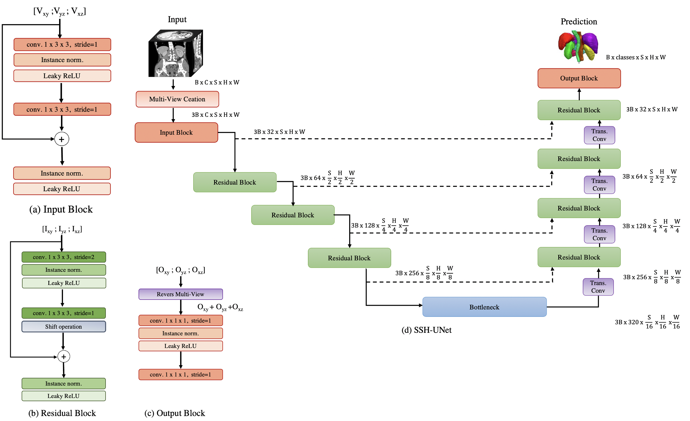

# SSH-UNet

This is the official Python code implementation for:

<b>Spatiotemporal Modeling Encounters 3D Medical Image Analysis: Slice-Shift UNet with Multi-View Fusion</b> <br/> 
Cynthia I. Ugwu, Sofia Casarin, Oswald Lanz<br/> 
[[ICMVA]](https://dl.acm.org/doi/abs/10.1145/3653946.3653965)<br/> 

The **ssh-unet** repository builds on insights from video action recognition to propose **Slice Shift UNet (SSH-UNet)**, 
a 2D-based model that encodes **3D features with the efficiency of 2D CNNs**. 
It achieves this by applying 2D convolutions across three orthogonal planes while using **weight sharing** 
to integrate multi-view features. The neglected third dimension is **reintroduced via feature map shifting** along the slice axis.

### **Improvements Over the Original Paper**  
- **Shift Mechanism Update**: Shifting is now applied after **both** convolutional layers (previously only after the second), leading to better results.  
- **Optional 3D Fusion Block**: Added the option to use at the output block **Volumetric Fusion Net (VFN)** [1], to enhance performance with minimal parameter overhead: from 6.48M to 12.51M.  
- **Advanced Shifting Mechanisms**: Two new shift strategies are offered GSM and GSF [2,3] beyond the original parameter-free method TSM [4].

<div style="display: flex; flex-direction: column; align-items: center;">
    
    <p style="text-align: center; font-style: italic;">Overview of SSH-UNet</p>
</div>


## Getting Started
SSH-UNet is a ri-adaptation of [MONAI](https://monai.io/)’s **DynUNet**, with most of the code based on the official MONAI implementation.
The code uses [PyTorch](https://pytorch.org/) for training. Follow the [official PyTorch installation guide](https://pytorch.org/get-started/locally/) 
to install the version compatible with your system. Additional required packages are listed in `requirements.txt`.
```bash
# clone project
git clone https://github.com/cugwu/ssh-unet.git
   
# [RECOMMENDED] set up a virtual environment
python -m venv venv_name  # choose your prefered venv_name
source venv_name/bin/activate

# install requirements
pip install -r requirements.txt
```

## Data preparation
The training data is from the [BTCV challenge dataset](https://www.synapse.org/Synapse:syn3193805/wiki/217752) and 
[AMOS segmentation dataset](https://amos22.grand-challenge.org/.). Use the provided link to download the datasets. 
We provide the JSON files  `btcv_dataset.json` `amos_task01_dataset.json` that are used to train our model. 
For testing submit your prediction on the original challenges websites.

#### BTCV:
* Target: 13 abdominal organs
* Task: Segmentation
* Modality: CT
* Size: 30 3D volumes (24 Training + 6 Validation)

#### AMOS
* Target: 15 abdominal organs 
* Task: Segmentation
* Modality: Task 1 (CT scans segmentation)
* Size: 300 3D volumes (200 Training + 100 Validation)

Make sure to specify the location of your dataset directory using `--data_dir`. Additionally, the JSON file must be 
placed in the same folder as the dataset.

We provide the results on the validation set from some possible configurations, you can find the output logs in `./logs_sshunet`.
In the *Dice acc.* column we have the best validation accuracy obtained during training and in brackets the validation accuracy 
in the original image space.

| SSH-UNet | with VFN | shifting type | # params | Dice acc. <br/>(overlap = 0.5) |
|----------|----------|---------------|----------|--------------------------------|
| BTCV     | no       | tsm           | 6.48M    | 0.826 (0.843)                  |
| BTCV     | no       | gsm           | 6.51M    | 0.831 (0.849)                  |
| BTCV     | no       | gsf           | 6.48M    | 0.834 (0.849)                  |
| BTCV     | yes      | tsm           | 12.51M   | 0.846 (0.825)                  |


## Training
In the `./runs` directory, you can find the original parameter configurations used to train AMOS and BTCV. 
Below is an example command for training AMOS **without k-fold cross-validation**, using **TSM as the shifting mechanism** 
positioned at all three resolution levels of SSH-UNet. The shifting mechanism is also applied in the **bottleneck block and decoder**.  
The model is trained for **1000 epochs** and evaluated every **100 epochs**.  

⚠ **Note:**  
The `--cache_num` argument enables a caching mechanism to preload a certain number of samples, which helps speed up training. 
If your memory is limited, consider reducing the cache value. In this case, it is set to **200**.  

### **Training Command:**  
```bash
python -u main.py --save_checkpoint --logdir "./results" --data_dir "./data" --json_list "task01_dataset.json" \
   --roi_x 96 --roi_y 96 --roi_z 96 --out_channels 16 --nfolds 1 --kernels 133 133 133 133 133 --gate_type "tsm" \
   --gate_pos 0 1 2 --gate_bottleneck --gate_dec --max_epochs 1000 --val_every 100 --patience 5 --optim_name "sgd" --optim_lr 0.01 \
   --batch_size 1 --cache_num 200 --a_min -991.0 --a_max 362.0 --b_min 0.0 --b_max 1.0 \
   --RandFlipd_prob 0.2 --RandRotate90d_prob 0.2 --RandScaleIntensityd_prob 0.5 --RandShiftIntensityd_prob 0.5
```
## Validation
Use the following commands to validate your model. Before computing accuracy, the transformations applied to the image will be reversed.
```bash
 python -u validation.py --pretrained_dir "./results" --pretrained_model_name "0model_lastsaved_fold0.pt" \
               --data_dir "./data" --exp_name "val_pred" --json_list "task01_dataset.json" \
               --roi_x 96 --roi_y 96 --roi_z 96 --out_channels 16 --kernels 133 133 133 133 133 \
               --gate_type "tsm"--gate_pos 0 1 2 --gate_bottleneck --gate_dec
```
### **Ensemble validation:** 
To validate using an ensemble of models, use the following command. You can choose between **mean** and **vote** ensemble methods by setting the `--ensemble_method` parameter accordingly.  
If using the **mean** ensemble, you must also specify the `--w_mee` parameter, which assigns a weight to each model in the ensemble. 
The ensemble predictions will be saved in the folder defined by `--out_dir` and `--exp_name`.
```bash
python -u validation_ensemble.py --pretrained_dir "./results" --pretrained_model_name "model_lastsaved_fold" \
                --data_dir "./data" --out_dir "/runs" --exp_name "val_pred_ensemble" --num_models 5 \
                --json_list "btcv_dataset.json" --roi_x 96 --roi_y 96 --roi_z 96 --out_channels 14 --kernels 133 133 133 133 133 \
                --gate_type "tsm" --gate_pos 0 1 2 --gate_bottleneck --gate_dec --ensemble_method "mean" --w_mee 0.95 0.94 0.95 0.94 0.90
```

## Test
With the following command, the challenge test set will be loaded, and the predictions will be saved in the folder specified by `--out_dir` and `--exp_name`.
The saved images can be uploaded to the original challenge website.
```bash
python -u test.py --pretrained_dir "./results" --pretrained_model_name "0model_lastsaved_fold0.pt" \
                --data_dir "./data" --out_dir "./runs" --exp_name "val_pred" \
                --json_list "btcv_dataset.json" --roi_x 96 --roi_y 96 --roi_z 96 --out_channels 14 \
                --kernels 133 133 133 133 133 --gate_type "tsm" --gate_pos 0 1 2 --gate_bottleneck --gate_dec
```

## License
This project is distributed under the Apache License, Version 2.0. See `LICENSE.txt` for more details.
Some parts of the code are licensed under the MIT License. For those cases, the MIT License text is included at the top 
of the respective files.

## Citation
If you use this code or find our work helpful for your research, please cite the following papers:
```bibtex
@inproceedings{ugwu2024spatiotemporal,
  title={Spatiotemporal Modeling Encounters 3D Medical Image Analysis: Slice-Shift UNet with Multi-View Fusion},
  author={Ugwu, Cynthia Ifeyinwa and Casarin, Sofia and Lanz, Oswald},
  booktitle={Proceedings of the 2024 7th International Conference on Machine Vision and Applications},
  pages={126--133},
  year={2024}
}
```

## References
[1] Y. Xia, L. Xie, F. Liu, Z. Zhu, E. K. Fishman, A. L. Yuille, Bridging the gap between 2d and 3d organ segmentation with
volumetric fusion net, in: International Conference on Medical Image Computing and Computer-Assisted Intervention,
Springer, 2018, pp. 445–453

[2] S. Sudhakaran, S. Escalera, O. Lanz, Gate-shift networks for video action recognition, 
in: Proceedings of the IEEE/CVF conference on computer vision and pattern recognition, 2020, pp. 1102-1111.

[3] S. Sudhakaran, S. Escalera, O. Lanz, Gate-shift-fuse for video action recognition. IEEE Transactions on Pattern Analysis and Machine Intelligence, 2023, 45.9: 10913-10928.

[4] J. Lin, C. Gan & S. Han, Tsm: Temporal shift module for efficient video understanding. In Proceedings of the IEEE/CVF international conference on computer vision, 2019, pp. 7083-7093.
